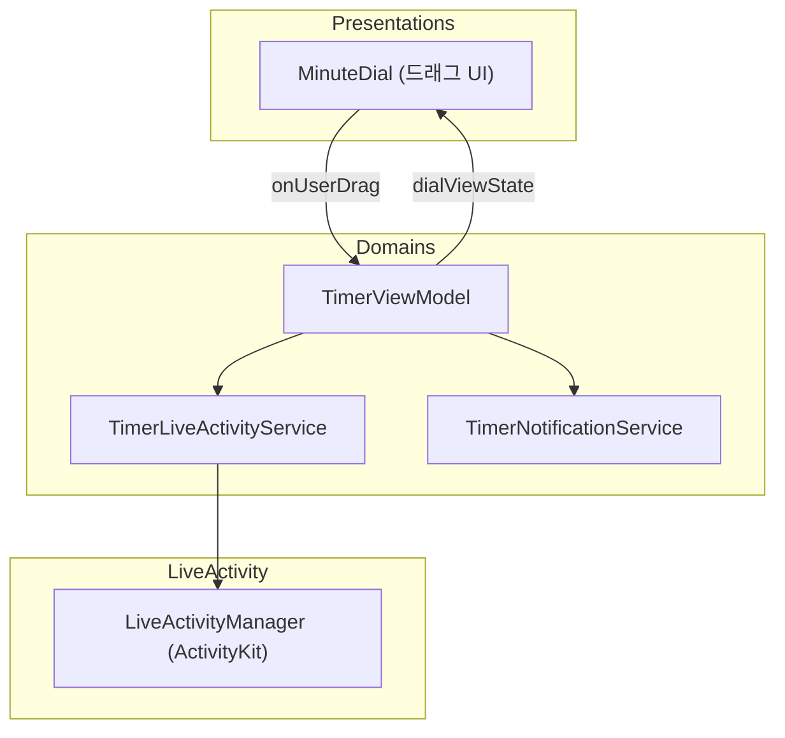

# TimerStamp

> 60분 집중 타이머를 원형 UI로 시각화하고, 앱을 벗어나도 LiveActivity로 남은 시간을 계속 확인할 수 있는 iOS 앱


[📱 App Store에서 다운로드](https://apps.apple.com/kr/app/timerstamp/id6747160684)


---

## 왜 만들었나

기존 타이머 앱은 남은 시간을 숫자로만 보여줘서, 60분이라는 시간이 실제로 얼마나 흘렀는지 감각적으로 와닿지 않았습니다. 원형 UI로 시간의 흐름을 시각화하고, 앱을 벗어나도 Dynamic Island / Lock Screen에서 남은 시간을 계속 확인할 수 있게 만들고 싶어서 시작했습니다.

학습 목적도 있었습니다 — 처음 다루는 SwiftUI를 Custom Shape·드래그 제스처·LiveActivity까지 실전 수준으로 익히는 것이 목표였습니다.

---

## 주요 기능

- **원형 드래그 타이머**: 손가락으로 1~59분을 설정하면 부채꼴 각도로 즉시 시각화
- **LiveActivity 연동**: 앱을 종료해도 Dynamic Island / Lock Screen에서 남은 시간 실시간 확인
- **집중 인증**: 완료 후 사진 촬영/선택 → 수행 시간을 시각화한 이미지 합성 → 저장/공유
- **다크모드**: 자동/수동 테마 전환
- **다국어**: 20개 언어 로컬라이징 (SwiftGen 기반 자동 생성)

---

## 기술 스택

- **SwiftUI** (Custom Shape·드래그 제스처·애니메이션을 UIKit 브릿징 없이 구현할 수 있고, ActivityKit·ImageRenderer 등 최신 프레임워크가 SwiftUI 기반이라 통합이 자연스러움)
- **ActivityKit** (앱이 백그라운드/종료 상태여도 Dynamic Island·Lock Screen에서 남은 시간을 갱신해야 해서)
- **ObservableObject + @Published** (SwiftUI View와 상태 바인딩이 자연스럽게 연동됨)
- **XCTest + 프로토콜 기반 Mock** (LiveActivity·시스템 알림처럼 실기기에 의존하는 서비스를 격리해 단위 테스트하기 위해)
- **SwiftGen** (20개 언어 로컬라이징 문자열을 자동 생성해 오타·누락을 방지)
- **Fastlane + GitHub Actions** (코드 서명·빌드·TestFlight 업로드를 브랜치 push 한 번으로 자동화)

---

## 아키텍처 / 동작 흐름



`Presentations → Domains → LiveActivity` 단방향 의존만 허용합니다. `ActivityKit`을 import하는 파일은 `LiveActivity/` 폴더 2곳뿐이고, `Presentations/`는 LiveActivity를 직접 참조하지 않습니다 — `Domains`가 노출하는 프로토콜(`TimerLiveActivityService`, `TimerNotificationService`)을 통해서만 접근합니다.

---

## AI(Claude Code) 활용

1인 프로젝트로 기획부터 배포까지 진행하면서, Claude Code를 리팩토링·버그 수정·학습·PR 작성 네 가지 목적으로 활용했습니다. 다만 AI를 무비판적으로 쓰지 않기 위해 역할과 권한을 문서(CLAUDE.md)로 먼저 정의하고 시작했습니다.

### 1. 리팩토링 — 코드 리뷰어로 활용

기존 코드를 읽게 하고 구조적 문제를 이슈로 등록하게 한 뒤, 별도 작업에서 해결하는 2단계로 진행했습니다. 매 이슈를 "문제(코드 근거) → 왜 문제인가(구체적 결과) → 해결 방향" 형식으로 남겼습니다.

| 발견한 문제 | 왜 문제였나 | 해결 |
|---|---|---|
| `TimerViewModel`이 `ActivityKit`·`UserNotifications`를 직접 호출 ([#6](https://github.com/seu11ee/TimerStamp/issues/6)) | 단위 테스트 시 실기기 알림이 실제로 발동, 타이머 코어만 재사용 불가 | 프로토콜 기반 의존성 주입으로 전환, 테스트 5→21개 확장 ([#14](https://github.com/seu11ee/TimerStamp/pull/14)) |
| 시간→각도 변환 공식이 파일마다 다르게 구현 ([#7](https://github.com/seu11ee/TimerStamp/issues/7)) | 수학적으로는 동일해도 표현이 갈라져 의도 파악이 어렵고 변경 시 한쪽만 고칠 위험 | `AngleConverter` 유틸로 통합, TDD로 59개 시나리오 검증 |
| `CertificationModalView` 한 파일에 View·이미지 합성·저장 로직 혼재 ([#1](https://github.com/seu11ee/TimerStamp/issues/1)) | UI 파일에 비즈니스 로직이 있어 테스트·재사용 불가능 | `CertificationImageRenderer` / `ImageSaveService`로 분리 ([#17](https://github.com/seu11ee/TimerStamp/pull/17)) |

### 2. 버그 픽스 — AI에게 위임한 워크플로우

버그 수정은 다음 흐름으로 진행했습니다.

1. 실기기에서 앱을 직접 사용하다가 버그 발견
2. AI에게 증상을 설명 (재현 조건, 기대 동작 vs 실제 동작)
3. AI가 코드를 탐색해 원인을 찾고 수정
4. 사람이 변경 사항을 검토한 뒤 커밋·PR 작성까지 위임

실제로 이 흐름으로 해결한 문제들은 [트러블슈팅](#트러블슈팅)에 정리했습니다.

### 3. 학습 — 모르는 개념을 위한 튜터

SwiftUI, ActivityKit, Swift Concurrency 등 처음 다루는 개념은 AI에게 동작 원리를 먼저 설명하게 하고, 예제 코드로 직접 검증하며 익혔습니다. 위 LiveActivity 버그처럼 "왜 이렇게 동작하는가"를 문서·자료와 대조해 확인하는 방식이 실제 코드 이해로 이어졌습니다.

### 4. PR 작성 — 반복 작업의 자동화

PR 작성은 CLAUDE.md에 미리 정의해 둔 규칙(동사 원형으로 시작하는 한 줄 커밋 메시지, 작업 요약 구조)을 따르도록 AI에게 위임했습니다. 실제로 병합된 11개 PR 전부 Claude Code가 작성했고, 커밋 메시지 포맷도 어긋난 적이 없습니다.

- **왜 위임했나**: PR 설명은 이미 끝난 작업을 요약·정리하는 것이라 판단이 개입할 여지가 적고, 매 작업마다 반복되는 일입니다. 사람이 손으로 같은 형식을 채우는 것보다 AI가 하는 게 빠르고, 반복적인 만큼 자동화 대상으로 적합했습니다.
- **효과**: 기록 형식이 사람 컨디션에 따라 흔들리지 않고 PR마다 일관되게 유지돼, 무엇을 왜 바꿨는지가 기록에서 누락될 여지가 줄었습니다.

### AI 협업 규칙

AI가 지킬 규칙을 코드보다 먼저 문서로 정의했습니다.

- **Source of Truth 우선순위**: 코드와 문서가 충돌하면 코드를 문서에 맞춤. 설계 자체를 바꿔야 하면 사람이 문서를 먼저 수정한 뒤 AI가 구현
- **역할 분리**: 이슈 정의·아키텍처 결정·PR 최종 승인·배포 트리거는 사람 / 코드 구현·테스트 작성·PR 초안은 AI
- **커스텀 명령**: `.claude/commands/`에 `/test` `/deploy` `/release`를 정의해 배포 절차를 표준화 — 예를 들어 `/deploy`는 fastlane 테스트가 실패하면 배포 자체를 중단하도록 절차에 안전장치를 내장했습니다. 반복 작업을 명령어로 캡슐화하는 경험을 위해 시도했습니다.

### AI가 하지 않은 것

- 실기기에서만 확인 가능한 LiveActivity 동작, 타이머 시작→종료→인증사진으로 이어지는 핵심 사용 흐름 검증은 직접 수행
- AI가 작성한 코드도 리뷰 없이 머지하지 않음

---

## 트러블슈팅

| 문제 | 원인 | 해결 |
|---|---|---|
| LiveActivity 종료 후 시간이 카운트업 ([PR #18](https://github.com/seu11ee/TimerStamp/pull/18)) | `Text(_, style: .timer)`가 앵커 날짜를 지나면 자동으로 카운트업 전환 | `Text(timerInterval:countsDown:)` 교체 + `end()` 시 `endDate: nil` 명시 |
| MinuteDial 드래그 중 0°/360° 경계에서 점프 | 단순 각도 차 계산이 최단 경로를 고려하지 않아 359°→1° 이동을 -358°로 해석 | `shortestDelta()`로 delta를 `[-180, 180]`에 클램프 |
| 분 기반·초 기반 각도 변환 결과 불일치 | 변환 공식이 파일마다 다르게 정의됨 | `AngleConverter` 유틸 추출 후 TDD로 59개 시나리오 검증 |
| TestFlight 중복 빌드 업로드 실패 (409) | 두 PR이 동시에 `release` 브랜치에 머지되어 deploy workflow가 두 번 트리거됨. 두 run이 같은 시점에 TestFlight 최신 빌드 번호를 조회해 동일한 빌드 번호로 각각 업로드 시도 | `deploy.yml`에 `concurrency` 그룹 추가(`cancel-in-progress: false`) — 두 번째 run은 첫 번째가 완료된 후 재조회해서 올바른 빌드 번호 사용 |
| MinuteDial 드래그 값이 바뀔 때마다 무조건 `reset()` 실행, View가 ViewModel 상태를 직접 변경 | `durationMinutes`가 `@Published` + `didSet`으로 구현되고 View와 양방향 `@Binding`으로 연결됨 | `onUserDrag` 콜백 + `idle` 상태에서만 허용되는 `setDurationMinutes()`로 단방향 전환, 각도 계산을 ViewModel(`dialViewState`)로 이전 |

---

## CI/CD

배포 실수를 줄이기 위해 절차를 자동화했습니다.

```
feature/* ──→ develop ──→ release ──→ main
                             │
                     push 시 TestFlight 자동 배포
```

- **PR 생성 시**: GitHub Actions가 빌드 + 테스트 자동 실행 (`fastlane test`)
- **`release` 브랜치 push 시**: Match로 코드 서명 → TestFlight 자동 업로드
- **`workflow_dispatch`**: `beta` / `release` 레인 수동 선택 실행 가능
- **Fastlane 레인**: `sync_certificates`(인증서 동기화) / `test` / `beta` / `release` 4개
- **앱스토어 심사 제출**: `release` 레인은 TestFlight 빌드를 App Store 버전에 연결하는 데까지만 자동화하고(`submit_for_review: false`), 실제 심사 제출은 App Store Connect에서 사람이 직접 진행 — 배포 타이밍을 의도적으로 사람이 결정하게 남겨둔 지점입니다

브랜치 push 한 번으로 코드 서명부터 TestFlight 업로드까지 끝나는 구조로, 배포 시 사람이 개입하는 지점을 "언제 배포할지 결정"으로만 줄였습니다.

---

## 테스트 구성

| 대상 | 개수 | 검증 내용 |
|---|---|---|
| `TimerViewModel` | 37 | 상태 전환(idle/running/paused/ended), Mock 서비스 호출 검증 |
| `MinuteDial` | 10 | 드래그 클램프, 0°/360° 경계 wrap-around |
| `AngleConverter` | 8 | 분↔각도 변환 일관성 (1~59분 전 구간) |
| **합계** | **55** | |

`TimerLiveActivityService` / `TimerNotificationService`를 프로토콜로 분리해 Mock 주입이 가능한 구조이기 때문에, 실기기 의존 없이 타이머 상태 로직만 격리해 테스트합니다. 테스트 코드는 대부분 AI가 작성했습니다 — 신뢰도에 대한 한계는 아래 회고에 남겨두었습니다.

---

## 회고 / 개선하고 싶은 점

- **핵심 사용 흐름 테스트 자동화 없음**: 타이머 시작→종료→인증사진 흐름은 수동 검증에 의존
- **AI가 작성한 테스트 코드의 신뢰도**: 테스트 코드 대부분을 AI에게 맡겨 작성했는데, 테스트 작성 경험이 많지 않아 55개 전체를 리뷰하지는 못했습니다. 테스트가 통과한다고 해서 로직이 옳다는 뜻은 아니며, 이미 작성된 로직에 맞춰 통과하도록 테스트가 짜였을 가능성을 배제할 수 없습니다
- **WWDC26에 소개된 LiveActivityIntent 도입**: LiveActivity에 상태를 보여주는 것을 넘어서 바로 액션을 취할 수 있는 LiveActivityIntent를 도입해 더 편리한 사용자 경험을 설계해보고 싶습니다.